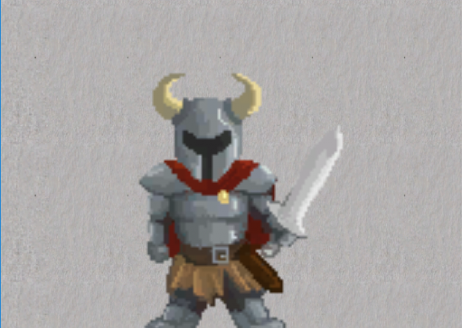
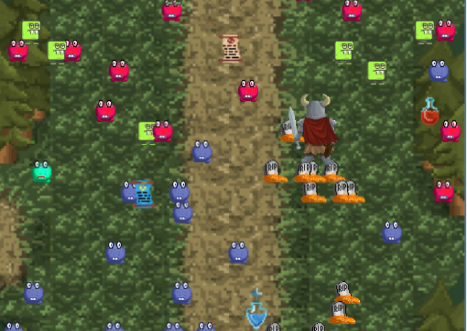
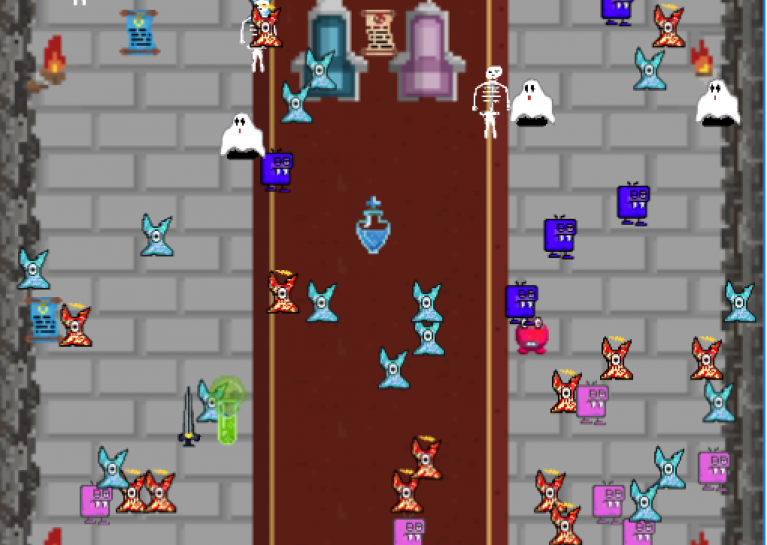
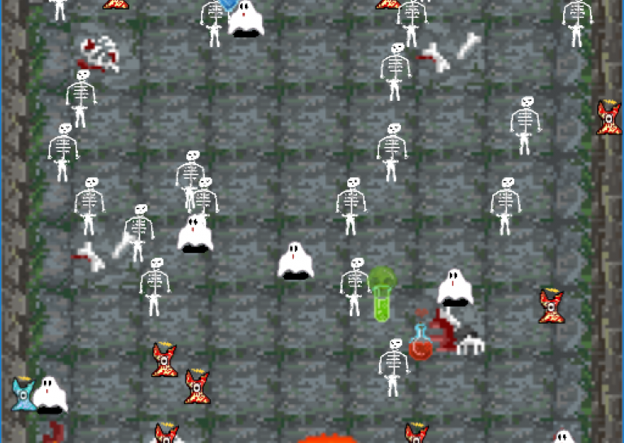

# One Tap Monster Waves

You are the mighty and fair heroine of the realm. Everybody knows it's you, who saves the world on a daily basis. But... something is wrong No one has seen neither the king nor the queen for several days ... and there are monsters outside the king's castle. It's up to you! Buckle up and fight your way through waves of monsters to see what holds queen and king back. One Tap Monster Waves is an RPG Game, where the player puts the heroine on a map and the hero progresses straightforward, fighting every enemy that stands in the way. Level up, collect items, cast spells and make your way to the dungeon, where the big bad Lindwurm awaits you.

Made during the [Global Game Jam 2017](https://globalgamejam.org/).

### [Play in the Browser](http://www.itec.uni-klu.ac.at/~mlux/games/ggj17/)

 
 

